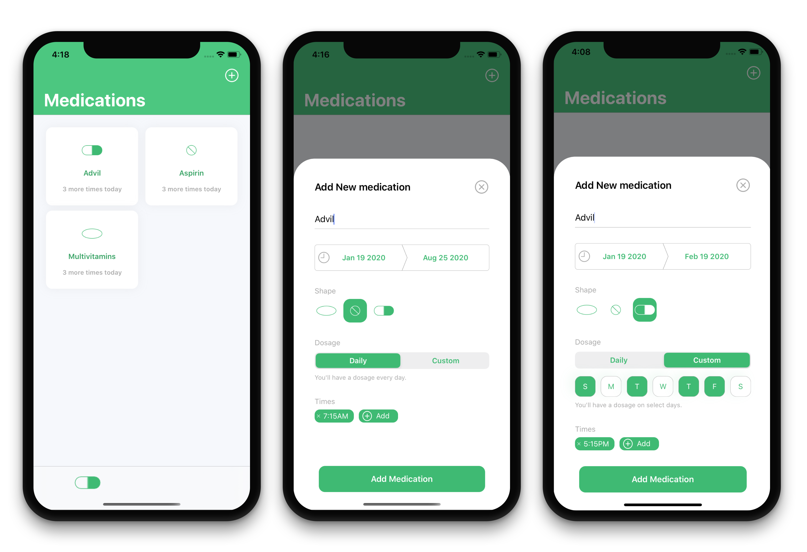

# Dosage

> Track your medications and get notifications when its time for your next dose

*This project is still in development and actively being worked on!*

## Introduction
This app is for those who find it a challenge to stay ontop on their medications.

Add all your current medications to the Dosage app and specify a start/end date, pill shape, dosage days and the time for each dosage.

The app will then remind you when it's time for your next dosage.

## Requirements
- XCode11
- Cocoapods

## Usage
`git clone https://github.com/markmansur/Dosage.git`

`cd Dosage`

`pod install`

Open `Dosage.xcworkspace` build and run the project.

## Author
This work is authored by Mark Mansur

## License
PackTrack is open-sourced under [MIT-License](https://opensource.org/licenses/MIT).